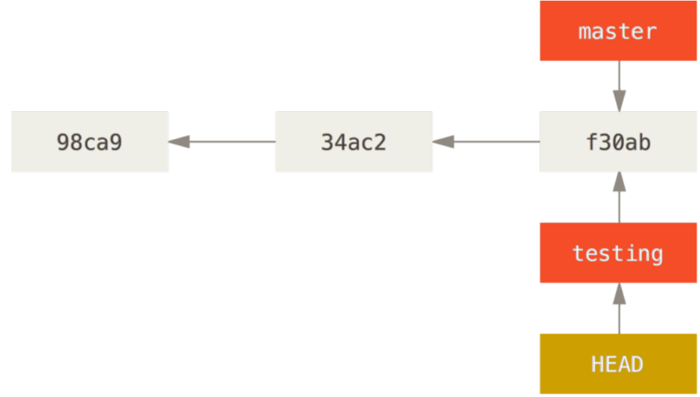
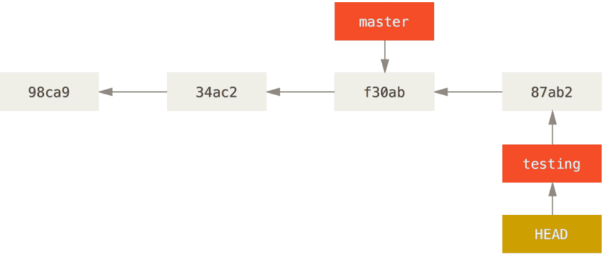
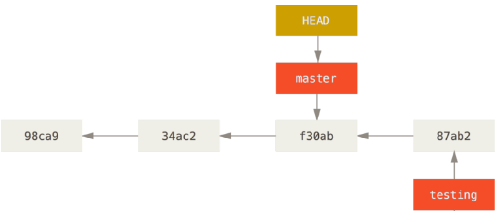
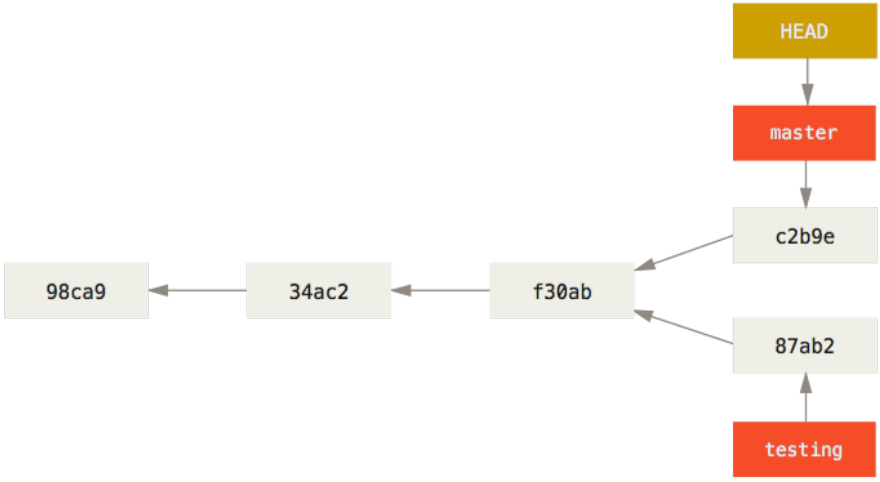

Git处理分支的方式可谓是难以置信的轻量，创建新分支这一操作几乎能在瞬间完成，并且在不同分支之间的切换操作也是一样便捷。

Git 鼓励在工作流程中频繁地使用分支与合并。

# 分支简介

在进行提交操作时，Git 会保存一个提交对象（commit object）。
该提交对象会包含一个指向暂存内容快照的指针，还包含了作者的姓
名和邮箱、提交时输入的信息以及指向它的父对象的指针。

首次提交产生的提交对象没有父对象，普通提交操作产生的提交对象有一个父对象，而由多个分支合并产生的提交对象有多个父对象。

Git的分支，其实本质上仅仅是指向提交对象的可变指针。

Git 的默认分支名字是`master`，并不是一个特殊分支。它就跟其它分支完全没有区别。 之所以几乎每一个仓库都有`master`分支，是因为`git init` 命令默认创建它，并且大多数人都懒得去改动它。

## 分支创建

比如，创建一个 `testing` 分支， 你需要使用 `git branch `命令：

    $ git branch testing

这会在当前所在的提交对象上创建一个指针。

如图所示：

Git又是怎么知道当前在哪一个分支上呢？ 也很简单，它有一个名为`HEAD` 的特殊指针。

在 Git 中，`HEAD`是一个指针，指向当前所在的本地分支。

`git branch` 命令仅仅创建 一个新分支，并不会自动切换到新分支中去。

 

你可以简单地使用 `git log` 命令查看各个分支当前所指的对象。 提供这一功能的参数是 `--decorate`。

    $ git log --oneline --decorate
        f30ab (HEAD, master, testing) add feature #32 - ability to add new
        34ac2 fixed bug #1328 - stack overflow under certain conditions
        98ca9 initial commit of my project

正如你所见，当前`master`和 `testing` 分支均指向校验和以 `f30ab`开头的提交对象。

## 分支切换

要切换到一个已存在的分支，你需要使用 `git checkout` 命令。 我们现在切换到新创建的 `testing`分支去：

    $ git checkout testing

这样 `HEAD` 就指向 `testing` 分支了。

在`testing`分支上面修改文件，提交一次。

    $ git commit -a -m 'made a change'

你的`testing` 分支向前移动了，但是`master`分支却没有：

现在我们切换回`master` 分支看看：
    $ git checkout master

这条命令做了两件事。 一是使`HEAD`指回 `master` 分支，二是将工作目录恢复成 `master` 分支所指向的快照内容。

也就是说，你现在做修改的话，项目将始于一个较旧的版本。 本质上来讲，这就是忽略 `testing` 分支所做的修改，以便于向另一个方向进行开发。

    

分支切换会改变你工作目录中的文件。如果是切换到一个较旧的分支，你
的工作目录会恢复到该分支最后一次提交时的样子。

我们不妨对`master`分支稍微做些修改并提交。

    $ git commit -a -m 'made other changes'

现在，这个项目的提交历史已经产生了分叉。

上述两次改动针对的是不同分支：你可以在不同分支间不断地来回切换和工作，并在时机成熟时将它们合并起来。 而所有这些工作，你需要的命令只有`branch`、`checkout` 和 `commit`。

你可以简单地使用 `git log` 命令查看分叉历史。

运行`git log --oneline --decorate --graph --all` ，它会输出你的提交历史、各个分支的指向以及项目的分支分叉情况。

    $ git log --oneline --decorate --graph --all
    * c2b9e (HEAD, master) made other changes
    | * 87ab2 (testing) made a change
    |/
    * f30ab add feature #32 - ability to add new formats to the
    * 34ac2 fixed bug #1328 - stack overflow under certain conditions
    * 98ca9 initial commit of my project

由于Git的分支实质上仅是包含所指对象校验和（长度为40的SHA-1值字符串）的文件，所以它的创建和销毁都异常高效。

这些高效的特性使得 Git 鼓励开发人员频繁地创建和使用分支。

**经常性地，我们要创建一个分支并且立即切换过去，需要执行：**

        git checkout -b <newbranchname>

# 分支的新建与合并