Git处理分支的方式可谓是难以置信的轻量，创建新分支这一操作几乎能在瞬间完成，并且在不同分支之间的切换操作也是一样便捷。

Git 鼓励在工作流程中频繁地使用分支与合并。

# 分支简介

在进行提交操作时，Git 会保存一个提交对象（commit object）。
该提交对象会包含一个指向暂存内容快照的指针，还包含了作者的姓
名和邮箱、提交时输入的信息以及指向它的父对象的指针。

首次提交产生的提交对象没有父对象，普通提交操作产生的提交对象有一个父对象，而由多个分支合并产生的提交对象有多个父对象。

Git的分支，其实本质上仅仅是指向提交对象的可变指针。

Git 的默认分支名字是`master`，并不是一个特殊分支。它就跟其它分支完全没有区别。 之所以几乎每一个仓库都有`master`分支，是因为`git init` 命令默认创建它，并且大多数人都懒得去改动它。

## 分支创建

比如，创建一个 `testing` 分支， 你需要使用 `git branch `命令：

    $ git branch testing

这会在当前所在的提交对象上创建一个指针。

如图所示：
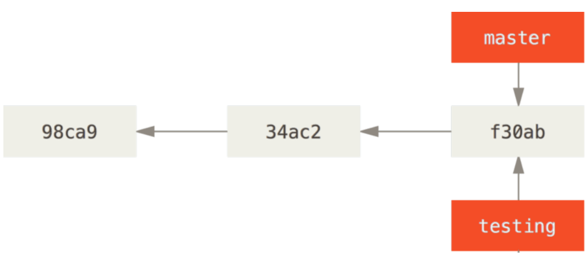

Git又是怎么知道当前在哪一个分支上呢？ 也很简单，它有一个名为`HEAD` 的特殊指针。

在 Git 中，`HEAD`是一个指针，指向当前所在的本地分支。

`git branch` 命令仅仅创建 一个新分支，并不会自动切换到新分支中去。

 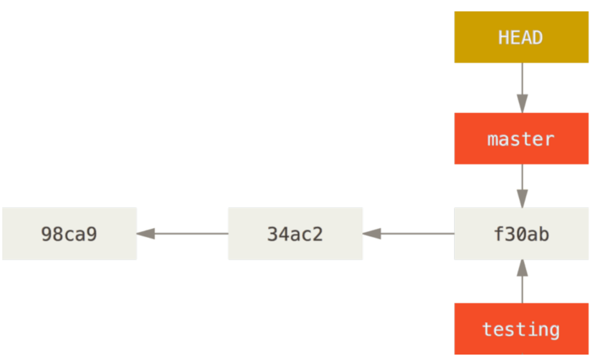

你可以简单地使用 `git log` 命令查看各个分支当前所指的对象。 提供这一功能的参数是 `--decorate`。

    $ git log --oneline --decorate
        f30ab (HEAD, master, testing) add feature #32 - ability to add new
        34ac2 fixed bug #1328 - stack overflow under certain conditions
        98ca9 initial commit of my project

正如你所见，当前`master`和 `testing` 分支均指向校验和以 `f30ab`开头的提交对象。

## 分支切换

要切换到一个已存在的分支，你需要使用 `git checkout` 命令。 我们现在切换到新创建的 `testing`分支去：

    $ git checkout testing

这样 `HEAD` 就指向 `testing` 分支了。

在`testing`分支上面修改文件，提交一次。

    $ git commit -a -m 'made a change'

你的`testing` 分支向前移动了，但是`master`分支却没有：

现在我们切换回`master` 分支看看：
    $ git checkout master

这条命令做了两件事。 一是使`HEAD`指回 `master` 分支，二是将工作目录恢复成 `master` 分支所指向的快照内容。

也就是说，你现在做修改的话，项目将始于一个较旧的版本。 本质上来讲，这就是忽略 `testing` 分支所做的修改，以便于向另一个方向进行开发。

    

分支切换会改变你工作目录中的文件。如果是切换到一个较旧的分支，你
的工作目录会恢复到该分支最后一次提交时的样子。

我们不妨对`master`分支稍微做些修改并提交。

    $ git commit -a -m 'made other changes'

现在，这个项目的提交历史已经产生了分叉。

上述两次改动针对的是不同分支：你可以在不同分支间不断地来回切换和工作，并在时机成熟时将它们合并起来。 而所有这些工作，你需要的命令只有`branch`、`checkout` 和 `commit`。

你可以简单地使用 `git log` 命令查看分叉历史。

运行`git log --oneline --decorate --graph --all` ，它会输出你的提交历史、各个分支的指向以及项目的分支分叉情况。

    $ git log --oneline --decorate --graph --all
    * c2b9e (HEAD, master) made other changes
    | * 87ab2 (testing) made a change
    |/
    * f30ab add feature #32 - ability to add new formats to the
    * 34ac2 fixed bug #1328 - stack overflow under certain conditions
    * 98ca9 initial commit of my project

由于Git的分支实质上仅是包含所指对象校验和（长度为40的SHA-1值字符串）的文件，所以它的创建和销毁都异常高效。

这些高效的特性使得 Git 鼓励开发人员频繁地创建和使用分支。

**经常性地，我们要创建一个分支并且立即切换过去，需要执行：**

        git checkout -b <newbranchname>

# 分支的新建与合并

让我们来看一个简单的分支新建与分支合并的例子，实际工作中你可能会用到类似的工作流。

## 新建分支

首先，我们假设你正在你的项目上工作，并且已经有一些提交。

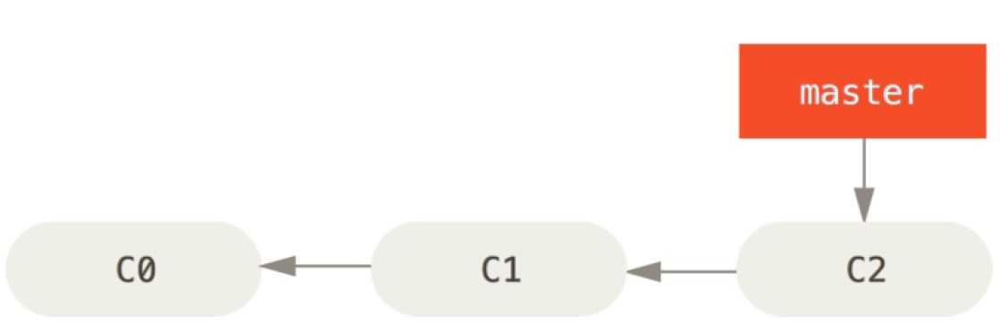

现在，你已经决定要解决你的公司使用的问题追踪系统中的 `#53` 问题。

想要新建一个分支并同时切换到那个分支上，你可以运行一个带有 `-b` 参数的 `git checkout` 命令：

    $ git checkout -b iss53
        Switched to a new branch "iss53"

它是下面两条命令的简写：

    $ git branch iss53
    $ git checkout iss53

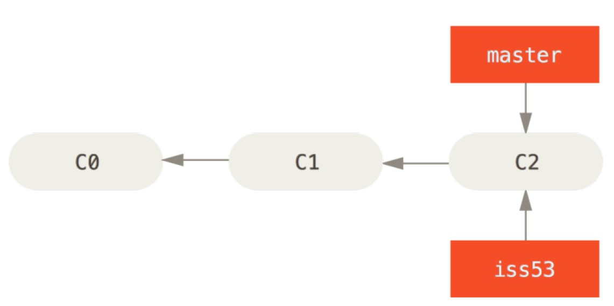

你继续在 `#53`问题上工作，并且做了一些提交。例如

    $ vim index.html
    $ git commit -a -m 'added a new footer [issue 53]'

在此过程中，`iss53` 分支在不断的向前推进，因为你已经检出
到该分支（也就是说，你的 `HEAD` 指针指向了 `iss53` 分支）

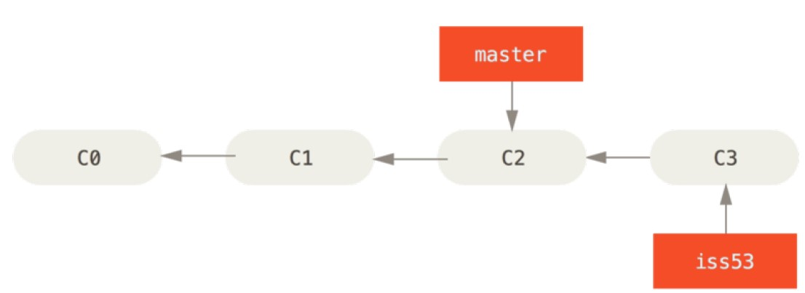

现在你接到那个电话，有个紧急问题等待你来解决。

你不必把这个紧急问题和`iss53` 的修改混在一起，
你所要做的仅仅是切换回 `master` 分支。

在你这么做之前，要留意你的工作目录和暂存区里那些还没有被提交的修改，它可能会和你即将检出的分支产生冲突从而阻止 Git 切换到该分支。 

最好的方法是，在你切换分支之前，保持好一个干净的状态。

现在，我们假设你已经把你的修改全部提交了，这时你可以切换回
`master` 分支了：

    $ git checkout master
    Switched to branch 'master' 

这个时候，你的工作目录和你在开始 `#53` 问题之前一模一样，现在你可以专心修复紧急问题了。

请牢记：

当你切换分支的时候，Git 会重置你的工作目录，使其看起来像回到了你在那个分支上最后一次提交的样子。 Git 会自动添加、删除、修改文件以确保此时你的工作目录和这个分支最后一次提交时的样子一模一样。

接下来，你要修复这个紧急问题。 
让我们建立一个针对该紧急问题的分支（hotfix branch），在该分支上工作直到问题解决：

    $ git checkout -b hotfix
    Switched to a new branch 'hotfix'

例如，

    $ vim index.html
    $ git commit -a -m 'fixed the broken email address'

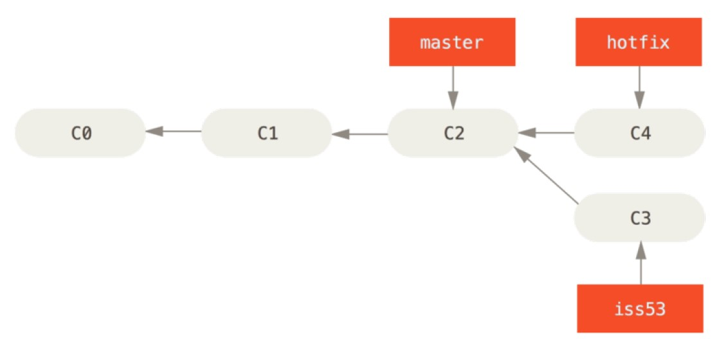

你可以运行你的测试，确保你的修改是正确的，然后将其合并回你的 `master` 分支来部署到线上。 

你可以切换回`master`分支使用`git merge` 命令来达到上述目的：

    $ git checkout master
    $ git merge hotfix
    Updating f42c576..3a0874c
    Fast-forward
    index.html | 2 ++
    1 file changed, 2 insertions(+)

在合并的时候，你应该注意到了"快进（fast-forward）"这个词。

由于当前 `master` 分支所指向的提交是你当前提交（有关 hotfix 的提交）的直接上游，所以Git只是简单的将指针向前移动。

换句话说，当你试图合并两个分支时，如果顺着一个分支走下去能够到达另一个分支，那么 Git 在合并两者的时候，只会简单的将指针向前推进（指针右移）。

因为这种情况下的合并操作没有需要解决的分歧——这就叫做 “快进（fast-forward）”。

现在，最新的修改已经在 `master` 分支所指向的提交快照中，你可以着手发布该修复了。

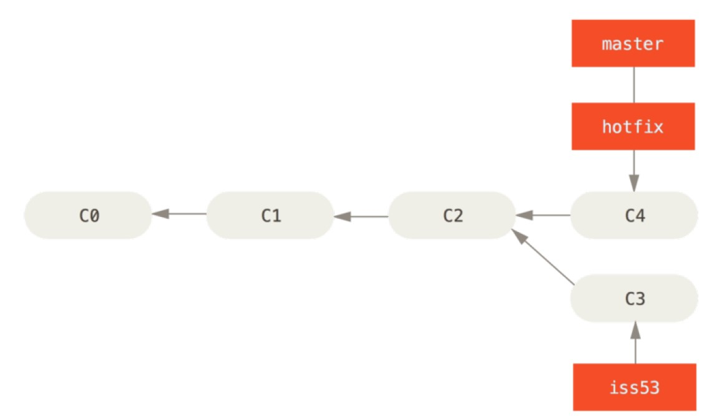

关于这个紧急问题的解决方案发布之后，你准备回到被打断之前时的工作中。

然而，你应该先删除`hotfix` 分支，因为你已经不再需要它了。
`master` 分支已经指向了同一个位置。 

你可以使用带`-d`选项的`git branch`命令来删除分支：

    $ git branch -d hotfix

现在你可以切换回你正在工作的分支继续你的工作，也就是针对 `#53` 问题的那个分支（iss53 分支）。

    $ git checkout iss53
    Switched to branch "iss53"

继续在iss53 分支进行工作：

    $ vim index.html
    $ git commit -a -m 'finished the new footer [issue 53]'

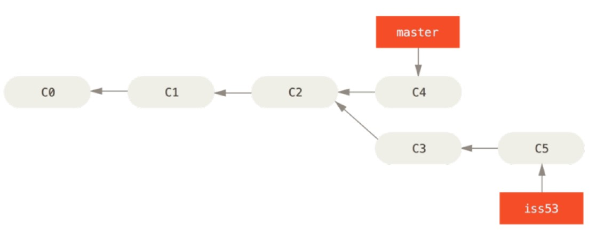

你在`hotfix` 分支上所做的工作并没有包含到 `iss53` 分支中。 

如果你需要拉取`hotfix`所做的修改，你可以使用
`git merge master` 命令将 `master` 分支合并入 `iss53` 分支，
或者你也可以等到 `iss53` 分支完成其使命，再将其合并回 `master` 分支。

## 分支的合并

假设你已经修正了 `#53` 问题，并且打算将你的工作合并入 `master` 分支。

你只需要检出到你想合并入的分支，然后运行`git merge` 命令：

    $ git checkout master
     Switched to branch 'master'

    $ git merge iss53
    Merge made by the 'recursive' strategy.

这和你之前合并 `hotfix` 分支的时候看起来有一点不一样。

在这种情况下，你的开发历史从一个更早的地方开始分叉开来（diverged）。 
因为，`master`分支所在提交并不是`iss53`分支所在提交的直接祖先，Git不得不做一些额外的工作。

出现这种情况的时候，Git会使用两个分支的末端所指的快照（C4 和 C5）以及这两个分支的共同祖先（C2），做一个简单的三方合并。

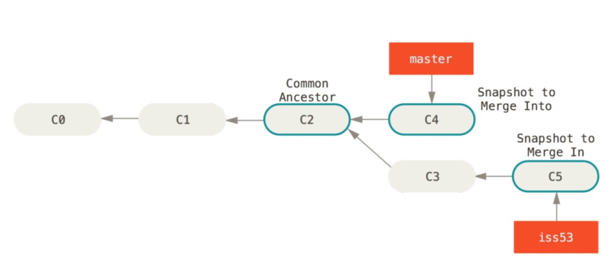

和之前将分支指针向前推进所不同的是，
Git 将此次三方合并的结果做了一个新的快照并且自动创建一个新的提交指向它。
这个被称作一次合并提交，它的特别之处在于他有不止一个父提交。

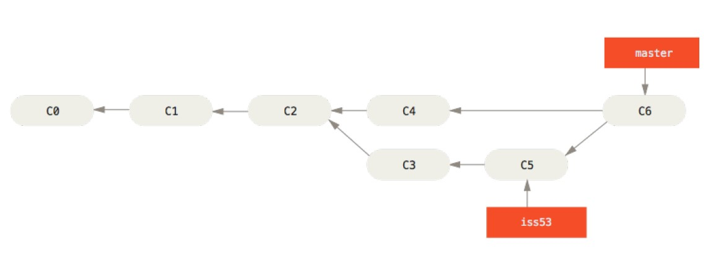

既然你的修改已经合并进来了，你已经不再需要`iss53`分支了。 
现在你可以在任务追踪系统中关闭此项任务，并删除这个分支。

    $ git branch -d iss53

## 遇到冲突时的分支合并

有时候合并操作不会如此顺利。 
如果你在两个不同的分支中，对同一个文件的同一个部分进行了不同的修改，Git 就没法干净的合并它们。

如果你对`#53`问题的修改和有关`hotfix` 的修改都涉及到同一个文件的同一处，
在合并它们的时候就会产生合并冲突：

    $ git merge iss53
    Auto-merging index.html
    CONFLICT (content): Merge conflict in index.html
    Automatic merge failed; fix conflicts and then commit the result.

此时Git 做了合并，但是没有自动地创建一个新的合并提交。 
Git 会暂停下来，等待你去解决合并产生的冲突。

你可以在合并冲突后的任意时刻使用 `git status` 命令来查看那些因包含合并冲突而处于未合并（unmerged）状态的文件：

    $ git status
    On branch master
    You have unmerged paths.
    (fix conflicts and run "git commit")

任何因包含合并冲突而有待解决的文件，都会以未合并状态标识出来。 
Git 会在有冲突的文件中加入标准的冲突解决标记，这样你可以打开这些包含冲突的文件然后手动解决冲突。

在你解决了所有文件里的冲突之后，对每个文件使用 `git add` 命令来将其标记为冲突已解决。 一旦暂存这些原本有冲突的文件，Git 就会将它们标记为冲突已解决。

如果你想使用图形化工具来解决冲突，你可以运行 `git mergetool`，该命令会为你启动一个合适的可视化合并工具，并带领你一步一步解决这些冲突。

你可以再次运行 `git status` 来确认所有的合并冲突都已被解决。

如果你对结果感到满意，并且确定之前有冲突的的文件都已经暂存了，这时你可以输入 `git commit` 来完成合并提交。

# 分支管理

让我们看看一些常用的分支管理工具。

`git branch` 命令不只是可以创建与删除分支。 如果不加任何参数运行它，会得到当前所有分支的一个列表：

    $ git branch
    iss53
    * master
    testing

注意 `master` 分支前的 * 字符：它代表现在检出的那一个分支（也就是说，当前 HEAD 指针所指向的分支）。这意味着如果在这时候提交，`master` 分支将会随着新的工作向前移动。 

如果需要查看每一个分支的最后一次提交，可以运行 `git branch -v` 命令：

    $ git branch -v
    iss53 93b412c fix javascript issue
    * master 7a98805 Merge branch 'iss53'
    testing 782fd34 add scott to the author list in the readmes

`--merged` 与 `--no-merged` 这两个有用的选项可以过滤这个列表中已经合并或尚未合并到当前分支的分支。

如果要查看哪些分支已经合并到当前分支，可以运行 `git branch --merged`。

    $ git branch --merged
    iss53
    * master

因为之前已经合并了`iss53` 分支，所以现在看到它在列表中。
在这个列表中分支名字前没有 `*` 号的分支通常可以使用 `git branch -d` 删除掉；
你已经将它们的工作整合到了另一个分支，所以并不会失去任何东西。

查看所有包含未合并工作的分支，可以运行 `git branch --no-merged`：

    $ git branch --no-merged
    testing

这里显示了其他分支。 
因为它包含了还未合并的工作，尝试使用 `git branch -d` 命令删除它时会失败：

    $ git branch -d testing
    error: The branch 'testing' is not fully merged.
    If you are sure you want to delete it, run 'git branch -D testing'.

如果真的想要删除分支并丢掉那些工作，如同帮助信息里所指出的，可以使用 `-D` 选项强制删除它。

# 分支开发工作流

在本节，我们会介绍一些常见的利用分支进行开发的工作流程。
而正是由于分支管理的便捷，才衍生出这些典型的工作模式，你可以根据项目实际情况选择一种用用看。

## 长期分支

因为 Git 使用简单的三方合并，在整个项目开发周期的不同阶段，你可以同时拥有多个开放的分支；你可以定期地把某些特性分支合并入其他分支中。

比如只在`master`分支上保留完全稳定的代码——有可能仅仅是已经发布或即将发布的代码。 
他们还有一些名为 `develop` 或者 `next` 的平行分支，被用来做后续开发或者测试稳定性——这些分支不必保持绝对稳定，但是一旦达到稳定状态，它们就可以被合并入 `master` 分支了。

这样，在确保这些已完成的特性分支能够通过所有测试，并且不会引入更多 bug 之后，就可以合并入主干分支中，等待下一次的发布。

事实上我们刚才讨论的，是随着你的提交而不断右移的指针。

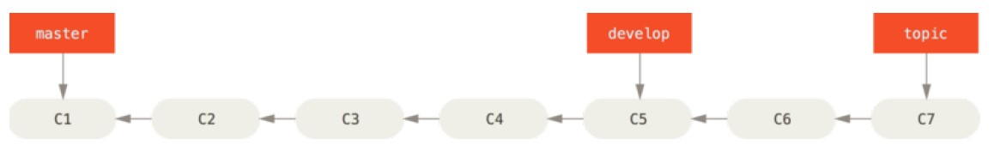

通常把他们想象成流水线（work silos）可能更好理解一点，那些经过测试考验的提交会被遴选到更加稳定的流水线上去。

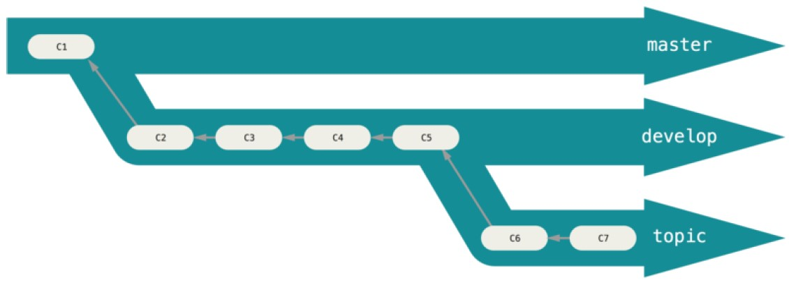

你可以用这种方法维护不同层次的稳定性。

使用多个长期分支的方法并非必要，但是这么做通常很有帮助，尤其是当你在一个非常庞大或者复杂的项目中工作时。

## 特性分支

特性分支对任何规模的项目都适用。
特性分支是一种短期分支，它被用来实现单一特性或其相关工作。

这项技术能使你快速并且完整地进行上下文切换（context-switch）。
你可以把做出的改动在特性分支中保留几分钟、几天甚至几个月，等它们成熟之后再合并，而不用在乎它们建立的顺序或工作进度。

请牢记，当你做这么多操作的时候，这些分支全部都存于本地。
当你新建和合并分支的时候，所有这一切都只发生在你本地的 Git 版本库中 —— 没有与服务器发生交互。

# 远程分支

远程引用是对远程仓库的引用（指针），包括分支、标签等等。
你可以通过 `git ls-remote (remote) `来显式地获得远程引用的完整列表，
或者通过 `git remote show (remote)` 获得远程分支的更多信息。

然而，一个更常见的做法是利用远程跟踪分支。

## 远程跟踪分支

远程跟踪分支是远程分支状态的引用。它们是你不能移动的本地引用，当你做任何网络通信操作时，它们会自动移动。

远程跟踪分支像是你上次连接到远程仓库时，那些分支所处状态的书签。

它们以 `(remote)/(branch)` 形式命名。

让我们来看一个例子。 

假设你的网络里有一个在 `git.ourcompany.com` 的 Git 服务器。 
如果你从这里克隆，Git 的 `clone` 命令会为你自动将其命名为 `origin`，拉取它的所有数据，创建一个指向它的 `master` 分支的指针，并且在本地将其命名为 `origin/master`。

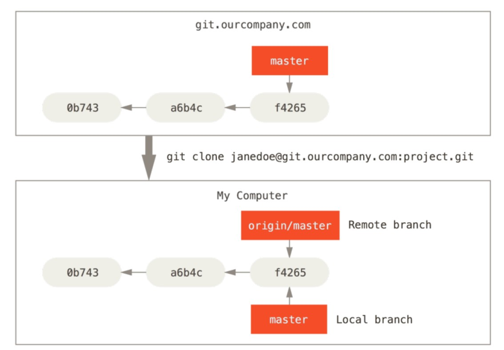

Git 也会给你一个与 `origin` 的 `master`分支在指向同一个地方的本地 `master` 分支，这样你就有工作的基础。

如果你在本地的 `master`分支做了一些工作，然而在同一时间，其他人推送提交到 git.ourcompany.com 并更新了它的 `master` 分支，那么你的提交历史将向不同的方向前进。 

也许，只要你不与`origin` 服务器连接，你的 `origin/master` 指针就不会移动。

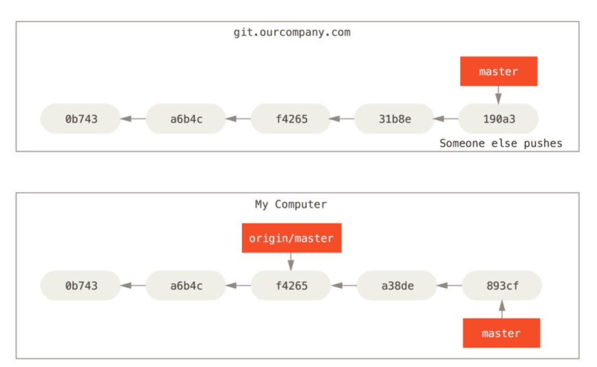

如果要同步你的工作，运行 `git fetch origin` 命令。 
这个命令查找 “origin” 是哪一个服务器（在本例中，它是 git.ourcompany.com），从中抓取本地没有的数据，并且更新本地数据库，移动 `origin/master`指针指向新的、更新后的位置。

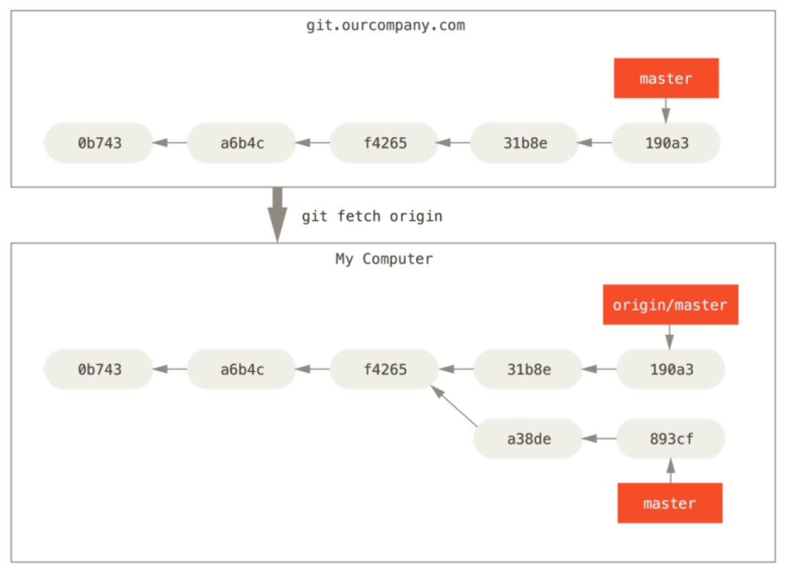

为了演示有多个远程仓库与远程分支的情况，我们假定你有另一个内部 Git 服务器，仅用于你的 sprint 小组的开发工作。 

这个服务器位于 `git.team1.ourcompany.com`。 你可以运行 `git remote add` 命令添加一个新的远程仓库引用到当前的项目， 将这个远程仓库命名为 teamone，将其作为整个 URL 的缩写。

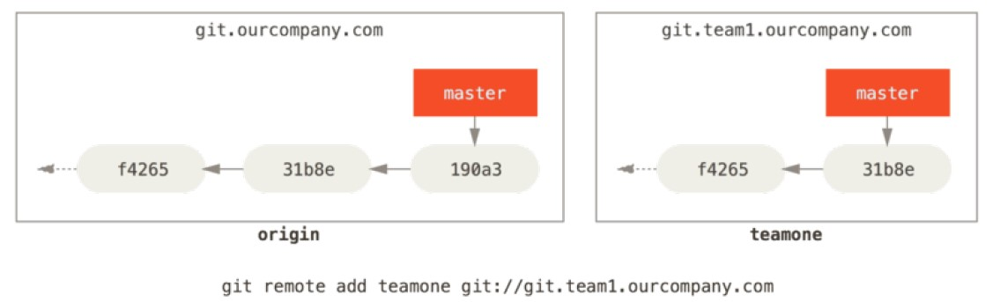

现在，可以运行 `git fetch teamone` 来抓取远程仓库 `teamone` 有而本地没有的数据。 因为那台服务器上现有的数据是 `origin` 服务器上的一个子集，所以 Git 并不会抓取数据而是会设置远程跟踪分支`teamone/master` 指向 `teamone` 的 `master` 分支。

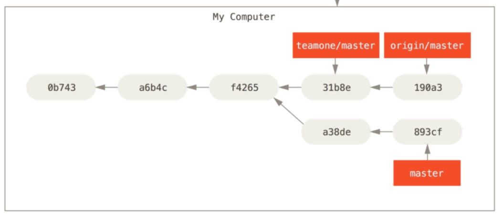

## 推送

本地的分支并不会自动与远程仓库同步 - 你必须显式地推送想要分享的分支。

这样，你就可以把不愿意分享的内容放到私人分支上，而将需要和别人协作的内容推送到公开分支。

如果希望和别人一起在名为 `serverfix` 的分支上工作，运行`git push (remote) (branch)`:

    $ git push origin serverfix

这里有些工作被简化了。 
Git自动将`serverfix` 分支名字展开为:`refs/heads/serverfix:refs/heads/serverfix`，
那意味着，“推送本地的serverfix分支来更新远程仓库上的 serverfix 分支。”

你也可以运行 `git push origin serverfix:serverfix`，它会做同样的事。
相当于推送本地的 `serverfix` 分支，将其作为远程仓库的`serverfix `分支。

可以通过这种格式来推送本地分支到一个命名不相同的远程分支。 如果并不想让远程仓库上的分支叫做`serverfix`，可以运行 `git push origin serverfix:awesomebranch` 来将本地的 `serverfix` 分支推送到远程仓库上的 `awesomebranch`分支。

下一次其他协作者从服务器上抓取数据时，他们会在本地生成一个远程分支` origin/serverfix`，指向服务器的`serverfix` 分支的引用：

    $ git fetch origin

要特别注意的一点是当抓取到新的远程跟踪分支时，本地不会自动生成一份可编辑的副本（拷贝）。 换一句话说，这种情况下，不会有一个新的 `serverfix 分支` - 只有一个不可以修改的` origin/serverfix` 指针。

可以运行 `git merge origin/serverfix` 将这些工作合并到当前所在的分支。
如果想要在自己的`serverfix` 分支上工作，可以将其建立在远程跟踪分支之上：

    $ git checkout -b serverfix origin/serverfix
    Branch serverfix set up to track remote branch serverfix from origin.
    Switched to a new branch 'serverfix'

这会给你一个用于工作的本地分支，并且起点位于 `origin/serverfix`。

## 跟踪分支

从一个远程跟踪分支检出一个本地分支会自动创建一个叫做 “跟踪分支”（有时也叫 “上游分支”）。

跟踪分支是与远程分支有直接关系的本地分支。
如果在一个跟踪分支上输入 `git pull`，Git能自动地识别去哪个服务器上抓取、合并到哪个分支。

当克隆一个仓库时，它通常会自动地创建一个跟踪 `origin/master` 的 `master` 分支。
然而，如果你愿意的话可以设置其他的跟踪分支 - 其他远程仓库上的跟踪分支，或者不跟踪`master` 分支。

最简单的就是之前看到的例子，运行 `git checkout -b [branch] [remotename]/[branch]`。

这是一个十分常用的操作，所以 Git 提供了`--track` 快捷方式：

    $ git checkout --track origin/serverfix
    Branch serverfix set up to track remote branch serverfix from origin.
    Switched to a new branch 'serverfix'

如果想要将本地分支与远程分支设置为不同名字，命令：

    $ git checkout -b sf origin/serverfix
    Branch sf set up to track remote branch serverfix from origin.
    Switched to a new branch 'sf'

现在，本地分支 `sf` 会自动从 `origin/serverfix` 拉取。

设置已有的本地分支跟踪一个刚刚拉取下来的远程分支，或者想要修改正在跟踪的上游分支，你可以在任意时间使用 `-u` 或 `--set-upstream-to` 选项运行 `git branch` 来显式地设置。

    $ git branch -u origin/serverfix
    Branch serverfix set up to track remote branch serverfix from origin.

上游快捷方式：

当设置好跟踪分支后，可以通过 `@{upstream}` 或 `@{u}` 快捷方式来引用它。 
所以在`master`分支时并且它正在跟踪 `origin/master` 时，如果愿意的话可以使用`git merge @{u} `来取代 `git merge origin/master`。

如果想要查看设置的所有跟踪分支，可以使用 `git branch` 的 `-vv` 选项。
这会将所有的本地分支列出来并且包含更多的信息，如每一个分支正在跟踪哪个远程分支与本地分支是否是领先、落后或是都有。

需要重点注意的一点是这些数字的值来自于你从每个服务器上最后一次抓取的数据。 
这个命令并没有连接服务器，它只会告诉你关于本地缓存的服务器数据。

如果想要统计最新的领先与落后数字，需要在运行此命令前抓取所有的远程仓库。 
可以像这样做：

    $ git fetch --all
    $ git branch -vv

## 拉取

当`git fetch` 命令从服务器上抓取本地没有的数据时，它并不会修改工作目录中的内容。 
它只会获取数据然后让你自己合并。 

然而，有一个命令叫作`git pull`在大多数情况下它的含义是一个 `git fetch` 紧接着一个
`git merge` 命令。

如果有一个像之前章节中演示的设置好的跟踪分支，不管它是显式地设置还是通过`clone`
或 `checkout` 命令为你创建的，`git pull` 都会查找当前分支所跟踪的服务器与分支，从服务器上抓取数据然后尝试合并入那个远程分支。

由于`git pull`的魔法经常令人困惑所以通常单独显式地使用`fetch` 与 `merge` 命令会更好一些。

## 删除远程分支

假设你已经通过远程分支做完所有的工作了 - 也就是说你和你的协作者已经完成了一个特性并且将其合并到了远程仓库的`master` 分支（或任何其他稳定代码分支）。

可以运行带有 `--delete` 选项的`git push` 命令来删除一个远程分支。 
如果想要从服务器上删除`serverfix`分支，运行下面的命令：

    $ git push origin --delete serverfix
    To https://github.com/schacon/simplegit
    - [deleted] serverfix

基本上这个命令做的只是从服务器上移除这个指针。 Git 服务器通常会保留数据一段时间直到垃圾回收运行，所以如果不小心删除掉了，通常是很容易恢复的。

# 变基

在 Git 中整合来自不同分支的修改主要有两种方法：`merge` 以及 `rebase`。 
在本节中我们将学习什么是“变基”，怎样使用“变基”，并将展示该操作的惊艳之处，以及指出在何种情况下你应避免使用它。

## 变基的基本操作

回顾之前分支的合并中的一个例子，你会看到开发任务分叉到两个不同分支，又各自提交了更新。

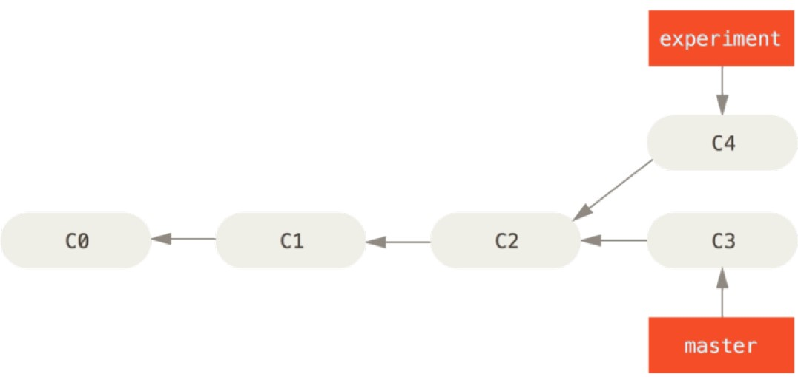

整合分支最容易的方法是 `merge` 命令。

它会把两个分支的最新快照（C3 和 C4）以及二者最近的共同祖先（C2）进行三方合并，合并的结果是生成一个新的快照（并提交）。

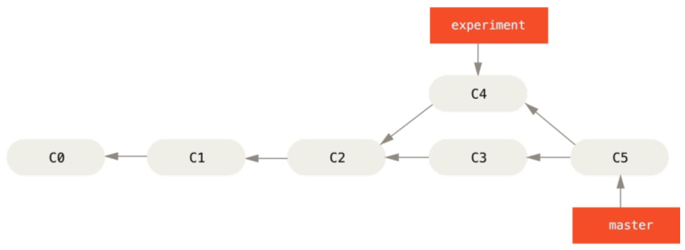

其实，还有一种方法：
你可以提取在 C4 中引入的补丁和修改，然后在 C3 的基础上应用一次。 

在 Git 中，这种操作就叫做变基。 你可以使用 rebase 命令将提交到某一分支上的所有修改都移至另一分支上，就好像“重新播放”一样。

在上面这个例子中，运行：
    
    $ git checkout experiment
    $ git rebase master

它的原理是首先找到这两个分支（即当前分支 `experiment`、变基操作的目标基底分支 `master`）的最近共同祖先 C2，

然后对比当前分支相对于该祖先的历次提交，提取相应的修改并存为临时文件，然后将当前分支指向目标基底 C3，最后以此将之前另存为临时文件的修改依序应用。 

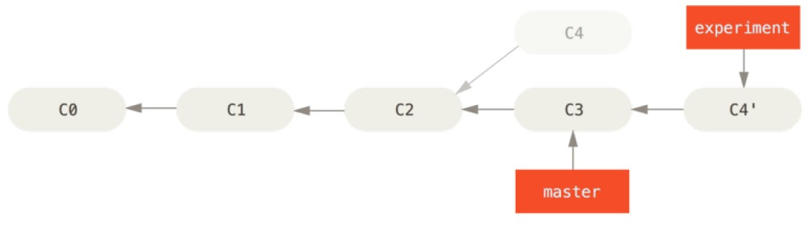

现在回到`master`分支，进行一次快进合并。

    $ git checkout master
    $ git merge experiment

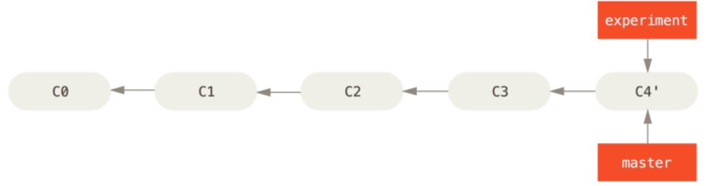

此时，C4' 指向的快照就和上面使用 `merge` 命令的例子中 C5 指向的快照一模一样了。 这两种整合方法的最终结果没有任何区别，但是变基使得提交历史更加整洁。

你在查看一个经过变基的分支的历史记录时会发现，尽管实际的开发工作是并行的，但它们看上去就像是串行的一样，提交历史是一条直线没有分叉。

一般我们这样做的目的是为了确保在向远程分支推送时能保持提交历史的整洁——例如向某个其他人维护的项目贡献代码时。 在这种情况下，你首先在自己的分支里进行开发，当开发完成时你需要先将你的代码变基到`origin/master` 上，然后再向主项目提交修改。 这样的话，该项目的维护者就不再需要进行整合工作，只需要快进合并便可。

请注意，无论是通过变基，还是通过三方合并，整合的最终结果所指向的快照始终是一样的，只不过提交历史不同罢了。 

变基是将一系列提交按照原有次序依次应用到另一分支上，而合并是把最终结果合在一起。

## 更有趣的变基例子

从一个特性分支里再分出一个特性分支的提交历史。
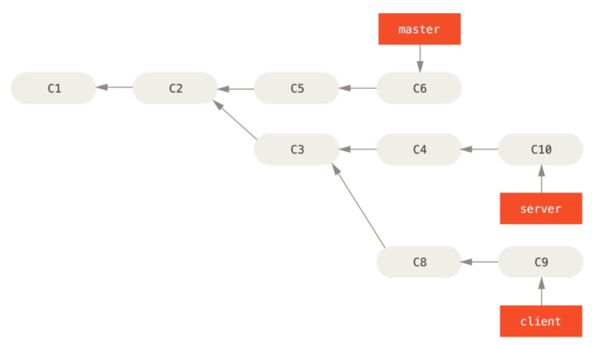

假设你希望将 `client` 中的修改合并到主分支并发布，但暂时并不想合并 `server` 中的修改，因为它们还需要经过更全面的测试。

这时，你就可以使用 `git rebase` 命令的 `--onto` 选项，选中在 `client` 分支里但不在`server`分支里的修改（即 C8 和 C9），将它们在 `master` 分支上重放：

    $ git rebase --onto master server client

以上命令的意思是：“取出 client 分支，找出处于 client 分支和 server 分支的共同祖先之后的修改，然后把它们在 `master` 分支上重放一遍”。 这理解起来有一点复杂，不过效果非常酷。

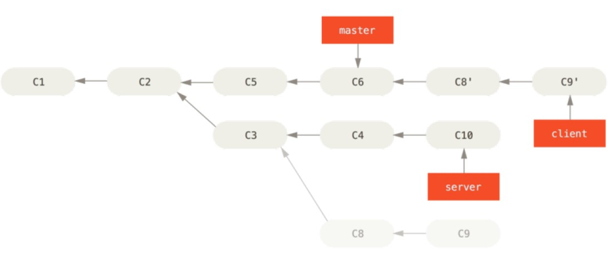

现在可以快进合并 `master` 分支了：

    $ git checkout master
    $ git merge client

接下来你决定将 `server` 分支中的修改也整合进来。 
使用 `git rebase [basebranch] [topicbranch]` 命令可以直接将特性分支（即本例中的 `server`）变基到目标分支（即 `master`）上。
这样做能省去你先切换到`server` 分支，再对其执行变基命令的多个步骤。

    $ git rebase master server

如图，将 `server` 中的修改变基到 `master` 上，`server` 中的代码被“续”到了 `master` 后面。

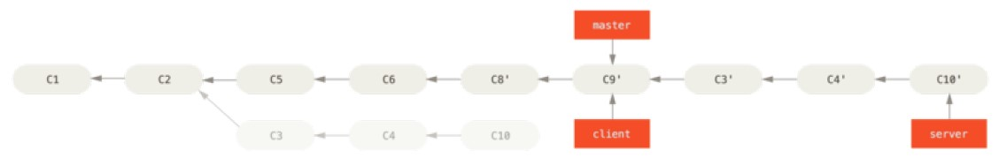

然后就可以快进合并主分支 `master` 了：

    $ git checkout master
    $ git merge server

至此，`client` 和 `server` 分支中的修改都已经整合到主分支里了，你可以删除这两个分支：

    $ git branch -d client
    $ git branch -d server

最终提交历史会变成：
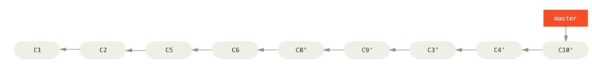

## 变基的风险

奇妙的变基也并非完美无缺，要用它得遵守一条准则：

> Do not rebase commits that exist outside your repository and people may have based work on them.

如果你遵循这条金科玉律，就不会出差错。

变基操作的实质是丢弃一些现有的提交，然后相应地新建一些内容一样但实际上不同的提交。

如果你已经将提交推送至某个仓库，而其他人也已经从该仓库拉取提交并进行了后续工作，此时，如果你用 `git rebase` 命令重新整理了提交并再次推送，你的同伴因此将不得不再次将他们手头的工作与你的提交进行整合，如果接下来你还要拉取并整合他们修改过的提交，事情就会变得一团糟。

## 用变基解决变基

如果你真的遭遇了类似的处境，Git 还有一些高级魔法可以帮到你。 
如果团队中的某人强制推送并覆盖了一些你所基于的提交，你需要做的就是检查你做了哪些修改，以及他们覆盖了哪些修改。

一种简单的方法是使用 `git pull --rebase` 命令而不是直接 `git pull`。
如果你习惯使用 `git pull` ，同时又希望默认使用选项 `--rebase`，你可以执行这条语句`git config --global pull.rebase true` 来更改 `pull.rebase` 的默认配置。

只要你把变基命令当作是在推送前清理提交使之整洁的工具，并且只在从未推送至共用仓库的提交上执行变基命令，就不会有事。

假如在那些已经被推送至共用仓库的提交上执行变基命令，并因此丢弃了一些别人的开发所
基于的提交，那你就有大麻烦了，你的同事也会因此鄙视你。

如果你或你的同事在某些情形下决意要这么做，请一定要通知每个人执行 `git pull --rebase` 命令，这样尽管不能避免伤痛，但能有所缓解。

## 变基 vs. 合并

你已在实战中学习了变基和合并的用法，你一定会想问，到底哪种方式更好。

在回答这个问题之前，让我们退后一步，想讨论一下提交历史到底意味着什么。

有一种观点认为，仓库的提交历史即是记录实际发生过什么。它是针对历史的文档，本身就有价值，不能乱改。从这个角度看来，改变提交历史是一种亵渎，你使用谎言掩盖了实际发生过的事情。 如果由合并产生的提交历史是一团糟怎么办？ 既然事实就是如此，那么这些痕迹就应该被保留下来，让后人能够查阅。

另一种观点则正好相反，他们认为提交历史是项目过程中发生的事。 没人会出版一本书的第一版草稿，软件维护手册也是需要反复修订才能方便使用。 持这一观点的人会使用`rebase` 及 `filter-branch` 等工具来编写故事，怎么方便后来的读者就怎么写。

这并没有一个简单的答案。 Git 是一个非常强大的工具，它允许你对提交历史做许多事情，但每个团队、每个项目对此的需求并不相同。 既然你已经分别学习了两者的用法，相信你能够根据实际情况作出明智的选择。

总的原则是，只对尚未推送或分享给别人的本地修改执行变基操作清理历史，从不对已推送至别处的提交执行变基操作，这样，你才能享受到两种方式带来的便利。

# 总结

我们已经讲完了 Git 分支与合并的基础知识。 

你现在应该能自如地创建并切换至新分支、在不同分支之间切换以及合并本地分支。 

你现在应该也能通过推送你的分支至共享服务以分享它们、使用共享分支与他人协作以及在
共享之前使用变基操作合并你的分支。