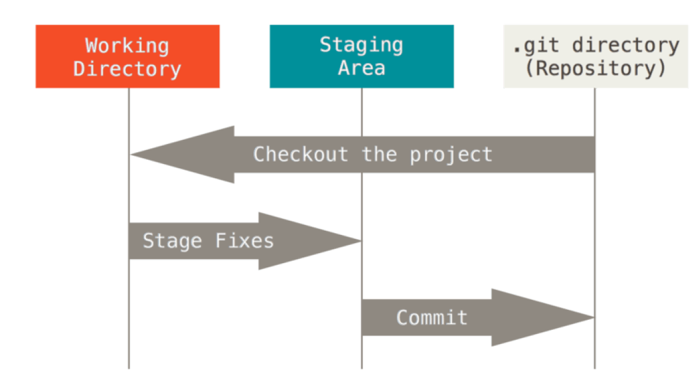

#  关于版本控制

*采用版本控制系统（VCS）是个明智的选择，
版本控制是一种记录一个或若干文件内容变化，  
以便将来查阅特定版本修订情况的系统。* 


- 本地版本控制系统

        大多都是采用某种简单的数据库来记录文件的历次更新差异。
        其中最流行的一种叫做 RCS。

- 集中化的版本控制系统

        Centralized Version Control Systems，简称 CVCS。
        诸如 CVS、Subversion 以及Perforce 等，
        单一的集中管理的服务器保存所有文件的修订版本。
        坏处是单点故障后无法协同、丢失变更历史。

- 分布式版本控制系统
        
        Distributed Version Control System，简称 DVCS。
        像Git、Mercurial、Bazaar 以及 Darcs 等，
        客户端并不只提取最新版本的文件快照，
        而是把代码仓库完整地镜像下来，
        可以根据需要设定不同的协作流程。

# Git 简史

`Git` 诞生于一个极富纷争大举创新的年代。

自诞生于2005 年以来，`Git` 日臻成熟完善，
在高度易用的同时，仍然保留着初期设定的目标：

- 速度
- 简单的设计
- 对非线性开发模式的强力支持
- 完全分布式
- 有能力高效管理类似 Linux 内核一样的超大规模项目

# Git 介绍

- 直接记录快照，而非差异比较

        Git对待数据更像是一个快照流。

- 近乎所有操作都是本地执行

        在 Git 中的绝大多数操作都只需要访问本地文件和资源，
        一般不需要来自网络上其它计算机的信息。

- Git保证完整性

        Git 中所有数据在存储前都计算校验和，然后以校验和来引用。
        这个功能建构在 Git 底层，是构成 Git 哲学不可或缺的部分。

- Git一般只添加数据

        你执行的Git操作，几乎只往 Git 数据库中增加数据。

- Git的三种状态
    - 已修改（modified）
            
            已修改表示修改了文件，但还没保存到数据库中

    - 已暂存（staged）

            已暂存表示对一个已修改文件的当前版本做了标记，
            使之包含在下次提交的快照中。

    - 已提交（committed）

            已提交表示数据已经安全的保存在本地数据库中。

- Git项目的三个工作区域
    - working tree

            工作目录是对项目的某个版本独立提取出来的内容。 
            这些从 Git 仓库的压缩数据库中提取出来的文件，
            放在磁盘上供你使用或修改。
    - staging area

            暂存区域是一个文件，保存了下次将提交的文件列表信息，
            一般在 Git仓库目录中。 有时候也被称作‘索引’，
            不过一般说法还是叫暂存区域。

    - Git directory

            Git仓库目录是Git保存项目的元数据和对象数据库的地方。 
            这是 Git中最重要的部分，
            从其它计算机克隆仓库时，拷贝的就是这里的数据。



# Git的工作流程

*基本的 Git 工作流程如下：*

1. 在工作目录中修改文件。
2. 暂存文件，将文件的快照放入暂存区域。
3. 提交更新，找到暂存区域的文件，将快照永久性存储到 Git仓库目录。

> 如果Git目录中保存着的特定版本文件，就属于已提交状态。 
>
> 如果作了修改并已放入暂存区域，就属于已暂存状态。 
>
>如果自上次取出后，作了修改但还没有放到暂存区域，就是已修改状态。


# 命令行

推荐使用Git命令行模式，  
因为GUI只实现了Git所有功能的一个子集以降低操作难度。

在Windows/linux/macOS上面安装git的步骤从略。

# 初次运行 Git 前的配置

Git自带一个`git config`的工具来帮助设置控制Git外观和行为的配置变量。

- 三个级别的配置
    - `/etc/gitconfig` 文件: 
        
        包含系统上每一个用户及他们仓库的通用配置。 
        如果使用`git  config --system` 时，
        它会从此文件读写配置变量。
        使用`git  config --system --list`查看

    - `~/.gitconfig` 或 `~/.config/git/config` 文件：
    
        只针对当前用户。
        使用`git  config --global --list`查看。  
        使用`git  config --global`进行读写。

    - 当前使用仓库的Git目录中的`config`文件（就是`.git/config`）：
    
        针对该仓库。 
        使用`git  config --local  --list`查看
        使用`git  config --local`进行读写。
        
> 每一个级别覆盖上一级别的配置，所以 `.git/config` 的配置变量会覆盖 `/etc/gitconfig` 中的配置变量。

>
> 在git bash下，使用`git  config  --list`查看全部参数，包括系统参数、用户参数。 

>
> 如果在具体项目的工作目录下运行`git  config  --list`，还会包括当前仓库的参数。你可能会看到重复的变量名，这种情况下，Git 会使用它找到的每一个变量的最后一个配置。

>
>你可以通过输入 `git config <key>`： 来检查 Git 的某一项配置，如
`$ git config user.name`

>
> 在 Windows系统中，Git会查找`$HOME`目录下（一般是 `C:\Users\$USER`）`.gitconfig `文件。

>
> Git同样也会寻找`/etc/gitconfig` 文件，但只限于安装 Git 时所选的目标位置(`C:\Program Files\Git\`)。


- 用户信息设置

    当安装完 Git 应该做的第一件事就是设置你的用户名称与邮件地址。
    
    ```bash
        $ git config --global user.name "John Doe"
        $ git config --global user.email "johndoe@example.com"
    ```

- 文本编辑器设置

    在安装windows版本的git时会推荐vs code，直接使用即可。 
    或者手动设置

        $ git config --global core.editor  "'C:\Users\u\AppData\Local\Programs\Microsoft VS Code\Code.exe' --wait"

# 获取帮助

使用如下命令：
```bash
 $ git help <verb>
 $ git <verb> --help

```
