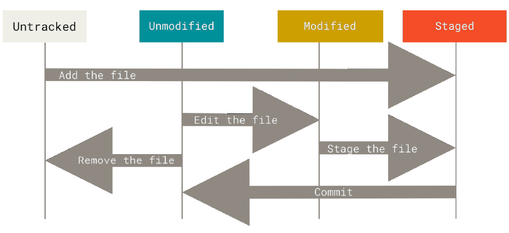
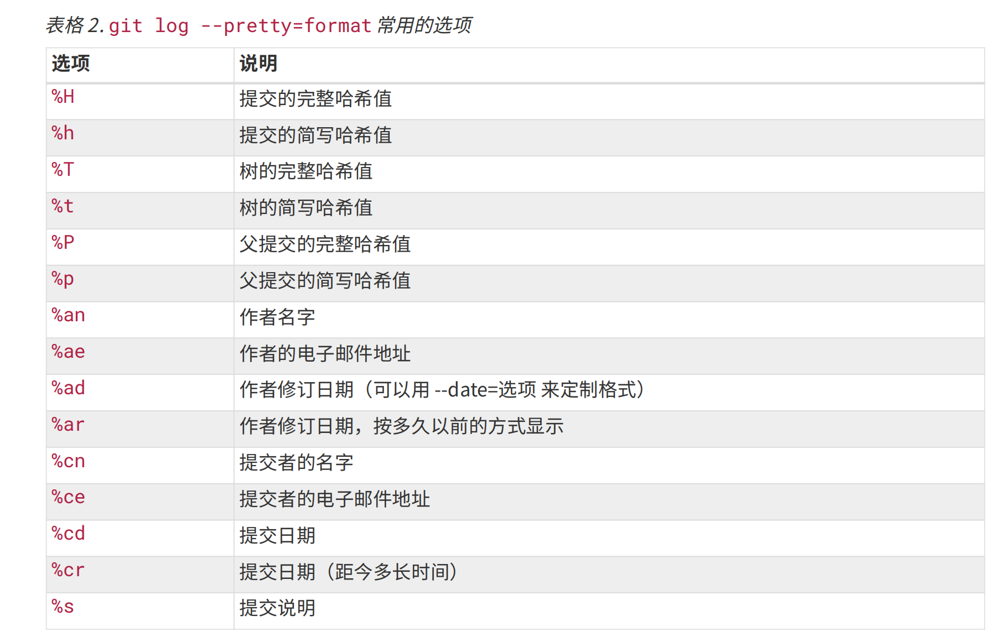
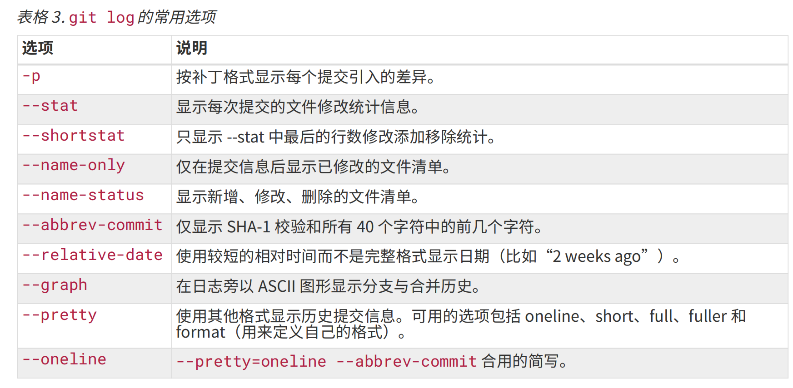
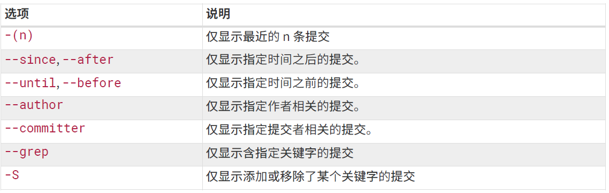

# 获取 Git 仓库

通常有两种获取 Git 项目仓库的方式：

1. 将尚未进行版本控制的本地目录转换为 Git 仓库； 
2. 从其它服务器克隆一个已存在的 Git仓库。

两种方式都会在你的本地机器上得到一个工作就绪的Git仓库。

- 在现有目录`my_project`中初始化仓库
  
    `$ git init`命令将创建一个名为 .git 的子目录，
    这个子目录含有你初始化的 Git仓库中所有的必须文件，
    这些文件是Git仓库的骨干。

    可通过`git add`命令来实现对指定文件的跟踪，
    然后执行`git commit -m` 提交。

    现在，你已经得到了一个存在被追踪文件与初始提交的Git仓库。

- 克隆现有的仓库

    `git clone [url] `命令获得一份已经存在了的 Git 仓库的拷贝。
    
    当你执行`git clone`命令的时候，默认配置下远程Git仓库中的每一个文件的每一个版本都将被拉取下来。

    例如，`$git clone https://github.com/libgit2/libgit2`会在当前目录下创建一个名为 “libgit2” 的目录.

    自定义本地仓库的名字，你可以使用如下命令：`$ git clone https://github.com/libgit2/libgit2 mylibgit`

    Git 支持多种数据传输协议。上面的例子使用的是 `https://` 协议，不过你也可以使用 `git://` 协议或者使用`SSH` 传输协议（ 比如`user@server:path/to/repo.git`）

# 记录每次更新到仓库

工作目录下的每一个文件都不外乎这两种状态：已跟踪 或 未跟踪。
- 已跟踪
 已跟踪的文件是指那些被纳入了版本控制的文件，
 在上一次快照中有它们的记录，在工作一段时间后，它们的状态可能是未修改、已修改、已放入暂存区。
 已跟踪的文件就是 Git 已经知道的文件。

- 未跟踪
它们既不存在于上次快照的记录中，也没有被放入暂存区。 
初次克隆某个仓库的时候，工作目录中的所有文件都属于已跟踪文件，并处于未修改状态。

使用 Git 时文件的生命周期如下：

## 检查当前文件状态

`$ git status`

如果在克隆仓库后立即使用此命令，会看到类似这样的输出：
       
    $ git status
        On branch master
        nothing to commit, working directory clean

> 分支名是`master`,这是默认的分支名
>
> 工作目录相当干净。所有已跟踪文件在上次提交后都未被更改过。

创建一个新的 README 文件:
    
    $echo 'My Project' > README

之前并不存在这个文件，使用`git status` 命令，
将看到一个新的未跟踪文件：

    $ git status
        On branch master
        Untracked files:
        (use "git add <file>..." to include in what will be committed)
        README
        nothing added to commit but untracked files present (use 
        "git add" to track)

未跟踪的文件意味着 Git在之前的快照（提交）中没有这些文件，
Git 不会自动将之纳入跟踪范围。

## 跟踪新文件

使用命令`git add` 开始跟踪一个新文件。 所以，要跟踪 README 文件，运行：

    $ git add README

再运行`git status` 命令，会看到 README 文件已被跟踪，并处于暂存状态：

    $ git status
        On branch master
        Changes to be committed:
            (use "git restore --staged <file>..." to unstage)
                new file:   Readme

只要在 Changes to be committed 这行下面的，就说明是已暂存状态。

如果此时提交，那么该文件此时此刻的版本将被留存在历史记录中。

`git add` 命令使用文件或目录的路径作为参数；如果参数是目录的路径，该
命令将递归地跟踪该目录下的所有文件。

## 暂存已修改文件

如果你又修改了一个名为 CONTRIBUTING.md 的已被跟踪的文件，然后运
行 `git status` 命令，会看到下面内容：

    $ git status
        On branch master
        Changes to be committed:
            (use "git restore --staged <file>..." to unstage)
                 new file:   Readme

        Changes not staged for commit:
            (use "git add <file>..." to update what will be committed)
            (use "git restore <file>..." to discard changes in working directory)
                modified:   CONTRIBUTING.md

文件 `CONTRIBUTING.md` 出现在 Changes not staged for commit 这行下面，说明已跟踪文件的内容发生了变化，但还没有放到暂存区。 要暂存这次更新，需要运行 `git add`命令。

因此，`git add`是个多功能命令：

可以用它开始跟踪新文件，或者把已跟踪的文件放到暂存区，还能用于合并时把有冲突的文件标记为已解决状态等。

将这个命令理解为“添加内容到下一次提交中”而不是“将一个文件添加到项目中”要更加合适。

然后再看看 `git status` 的输出:

    $ git add CONTRIBUTING.md
    $ git status
        On branch master
        Changes to be committed:
            (use "git restore --staged <file>..." to unstage)
              modified:   CONTRIBUTING.md
              new file:   Readme

现在两个文件都已暂存，下次提交时就会一并记录到仓库。

假设此时，你在 `CONTRIBUTING.md`里再加条注释， 重新编辑存盘。
运行`git status`，`CONTRIBUTING.md` 文件同时出现在暂存区和非暂存区。

    $ git status
        On branch master
        Changes to be committed:
            (use "git restore --staged <file>..." to unstage)
                modified:   CONTRIBUTING.md
                new file:   Readme

        Changes not staged for commit:
            (use "git add <file>..." to update what will be committed)
            (use "git restore <file>..." to discard changes in working directory)
                modified:   CONTRIBUTING.md

实际上，Git只不过暂存了你运行 `git add` 命令时的版本
所以，运行了`git add`之后又作了修订的文件，需要重新运行`git add` 把最新版本重新暂存起来：

    $ git add CONTRIBUTING.md
    $ git status
        On branch master
        Changes to be committed:
            (use "git restore --staged <file>..." to unstage)
             modified:   CONTRIBUTING.md
             new file:   Readme

## 状态简览

运行 `git status -s`得到一种更为紧凑的格式输出:

假设状态报告输出如下：

    $ git status -s
      M README
     MM Rakefile
     A lib/git.rb
     M lib/simplegit.rb
     ?? LICENSE.txt

- ??   新添加的未跟踪文件 
- A    新添加的而且到暂存区中的文件 
- 靠右边的M    表示该文件被修改了但是还没放入暂存区
- 靠左边的M    表示该文件被修改了并放入了暂存区
- MM  在工作区被修改并提交到暂存区后又在工作区中被修改了

以此类推。

## 忽略文件

有些文件无需纳入 Git 的管理，也不希望它们总出现在未跟踪文件列表。
比如日志文件，或者编译过程中创建的临时文件等。

创建一个名为 `.gitignore`的文件，列出要忽略的文件模式。
例如：

    $ cat .gitignore

    *.[oa]
    *~

- 忽略所有以 .o 或 .a 结尾的文件。
- 忽略以波浪符（~）结尾的文件。

要养成一开始就为你的新仓库设置好 `.gitignore` 文件的习惯，
以免将来误提交这类无用的文件。

**文件 `.gitignore` 的格式规范如下：**

- 所有空行或者以`#`开头的行都会被 Git 忽略。
- 可以使用标准的 glob 模式匹配。它会递归地应用在整个工作区中。
    - 星号（*）匹配零个或多个任意字符
    - 问号（?）只匹配一个任意字符
    - [abc] 匹配任何一个列在方括号中的字符（要么匹配一个a，要么匹配一个b，要么匹配一个c）
    - [0-9] 表示匹配所有 0 到 9 的数字
    - 使用两个星号(**) 表示匹配任意中间目录: a/\*\*/z，代表a/z,a/b/z,a/b/c/z等。

- 匹配模式可以以（/）开头防止递归。
- 匹配模式可以以（/）结尾指定目录。
- 要忽略指定模式以外的文件或目录，可以在模式前加上惊叹号`!`取反。

GitHub 有一个十分详细的针对数十种项目及语言的 `.gitignore` 文件列表，参考：[A collection of .gitignore templates](https://github.com/github/gitignore)

在最简单的情况下，一个仓库可能只根目录下有一个 `.gitignore` 文件，它递归地应用到整个仓库中。 然而，子目录下也可以有额外的 `.gitignore` 文件。子目录中的 `.gitignore`文件中的规则只作用于它所在的目录中。

## 查看已暂存和未暂存的修改

如果`git status`命令的输出对于你来说过于模糊，
你想知道具体修改了什么地方，可以用`git diff`命令。

`git diff` 将通过文件补丁的格式显示具体哪些行发生了改变。

再次修改 `README` 文件后暂存，
然后编辑 `CONTRIBUTING.md` 文件后先不暂存， 
运行 `git status` 命令将会看到：

    $ git status
    On branch master
    Changes to be committed:
        (use "git restore --staged <file>..." to unstage)
         modified:   Readme

    Changes not staged for commit:
        (use "git add <file>..." to update what will be committed)
        (use "git restore <file>..." to discard changes in working directory)
        modified:   CONTRIBUTING.md

- 要查看尚未暂存的文件`CONTRIBUTING.md`更新了哪些部分，不加参数直接输入 `git diff`。

    此命令比较的是工作目录中当前文件和暂存区域快照之间的差异， 也就是修改之后还没有暂存起来的变化内容。

- 若要查看已暂存的将要添加到下次提交里的内容，可以用 `git diff --cached` 命令或者`git diff --staged`。

     这条命令将比对已暂存文件与最后一次提交的文件差异：

像之前说的，先暂存`CONTRIBUTING.md` 后再编辑，
运行`git diff`和`git diff --cached`效果不同。

在本书中，我们使用 `git diff` 来分析文件差异。 但是你也可以使用图形化的工具或外部diff工具来比较差异。

## 提交更新

暂存区域已经准备妥当可以提交了。

每次准备提交前，先用`git status`看下，是不是都已暂存起来了，
请务必确认还有什么已修改或新建的文件还没有 `git add` 过，
然后再运行提交命令`git commit`:

    $ git commit

这种方式会启动文本编辑器以便输入本次提交的说明。

使用 `git config --global core.editor` 命令设定你喜欢的编辑软件

默认的提交消息包含最后一次运行 `git status`的输出，放在注释行里

另外开头还有一空行，供你输入提交说明。

退出编辑器时，Git 会丢掉注释行，用你输入提交附带信息生成一次提交。

也可以在 `commit` 命令后添加 `-m `选项，将提交信息与命令放在同一行，如下所示：

    $ git commit -m "Story 182: Fix benchmarks for speed"
    [master 463dc4f] Story 182: Fix benchmarks for speed
    2 files changed, 2 insertions(+)
    create mode 100644 README

可以看到，提交后它会告诉你，当前是在哪个分支（master）提交的，
本次提交的完整 SHA-1 校验和是什么（463dc4f），
以及在本次提交中，有多少文件修订过，多少行添加和删改过。

每一次运行提交操作，都是对你项目作一次快照，以后可以回到这个状态，或者进行比较。

## 跳过使用暂存区域

使用暂存区域的方式可以精心准备要提交的细节，有时候略显繁琐。

Git 提供了一个跳过使用暂存区域的方式

使用`git commit -a -m "msg"` ，其中`-a`选项，就会自动把所有已经跟踪过的文件暂存起来一并提交，从而跳过 `git add` 步骤，**必须是已经跟踪过的文件**。

## 移除文件

要从 Git中移除某个文件，就必须要从已跟踪文件清单中移除（确切地说，是从暂存区域移除），然后提交。

可以用 `git rm XXX` 命令完成此项工作，并连带从工作目录中删除指定的文件，这样以后就不会出现在未跟踪文件清单中了。

如果只是简单地从工作目录中手工删除文件，运行 `git status` 时就会在 “Changes not staged for commit” 部分（也就是 未暂存清单）看到：

    $ rm PROJECTS.md
    $ git status
    On branch master
    Your branch is up-to-date with 'origin/master'.

    Changes not staged for commit:
    (use "git add/rm <file>..." to update what will be committed)
    (use "git checkout -- <file>..." to discard changes in working
    directory)

    deleted: PROJECTS.md
    no changes added to commit (use "git add" and/or "git commit -a")

再运行 `git rm` 记录此次移除文件的操作：

    $ git rm PROJECTS.md
    rm 'PROJECTS.md'
    $ git status
    On branch master
    Changes to be committed:
    (use "git reset HEAD <file>..." to unstage)
    deleted: PROJECTS.md

下一次提交时，该文件就不再纳入版本管理了。

`git rm `命令后面可以列出文件或者目录的名字，也可以使用 `glob` 模式。 比方说：

这个命令删除 log/ 目录下扩展名为 .log 的所有文件
    
    $ git rm log/\*.log

下面的命令删除以 ~ 结尾的所有文件：

    $ git rm \*~   

> 如果删除之前修改过并且已经放到暂存区域的话，则必须要用强制删除选项 `-f`。 这是一种安全特性，用于防止误删还没有添加到快照的数据，这样的数据不能被 Git 恢复。

    $ git rm .\Rakefile    
        error: the following file has changes staged in the index:
            Rakefile
            (use --cached to keep the file, or -f to force removal)

> 另外一种情况是，我们想把文件从 Git 仓库中删除（亦即从暂存区域移除），但仍然希望保留在当前工作目录中。 
>
> 换句话说，你想让文件保留在磁盘，但是并不想让 Git 继续跟踪。 当你忘记添加 .gitignore 文件，不小心把日志文件等添加到暂存区时，这一做法尤其有用，使用 `--cached` 选项。
>
例如，

    $ git rm --cached .\Rakefile
    $ git status       
    On branch master
    Changes to be committed:
        (use "git restore --staged <file>..." to unstage)
        deleted:    Rakefile

    Untracked files:
        (use "git add <file>..." to include in what will be committed)
        Rakefile

## 移动文件
Git 并不显式跟踪文件移动操作。

要在 Git 中对文件改名，可以这么做：

    $ git mv file_from file_to

它会恰如预期般正常工作：

    $ git mv README.md README
    
    $ git status
    On branch master
    Changes to be committed:
    (use "git reset HEAD <file>..." to unstage)
    renamed: README.md -> README

其实，运行 git mv 就相当于运行了下面三条命令：

    $ mv README.md README
    $ git rm README.md
    $ git add README

# 查看提交历史

回顾下提交历史。 
完成这个任务最简单而又有效的工具是 `git log` 命令。

    $ git log

默认不用任何参数的话，`git log` 会按提交时间列出所有的更新，最近的更新排在最上面。 

这个命令会列出每个提交的 SHA-1 校验和、作者的名字和电子邮件地址、提交时间以及提交说明。

`git log` 有许多选项可以帮助你搜寻你所要找的提交:

    $ git log -p -2
    -p  用来显示每次提交的内容差异
    -2  仅显示最近两次提交

    $ git log --stat
    提交的简略的统计信息

    $ git log --pretty=
     指定使用不同于默认格式的方式展示提交历史
     这个选项有一些内建的子选项供你使用 比如oneline会将每个提交放在一行显示

    $ git log --pretty=format:"%h - %an, %ar : %s"
    最有意思的是 format ，可以定制记录的显示格式。

    $ git log --pretty=format:"%h %s" --graph
    当 oneline 或 format 与另一个 log 选项 --graph 结合使用时尤其有用。 
    这个选项添加了一些 ASCII 字符串来形象地展示你的分支、合并历史。

**`git log  --pretty=format:`的常用输出格式，参考如下：**

**`git log` 的常用选项，参考如下：**

## 限制输出长度

除了定制输出格式的选项之外，
`git log` 还有许多非常实用的限制输出长度的选项。

例如：
- 仅显示最近的若干条提交：`-n` ， n可以是任何整数  
- 按照时间作限制的选项，`--since` 和 `--until`
    
        $ git log --since=2.weeks  
        列出所有最近两周内的提交 

- 另一个非常有用的过滤器是 `-S`

        $ git log -S function_name
        找出添加或删除了对某一个特定函数的引用的提交

限制`git log` 输出的选项参考如下：

# 撤消操作

在任何一个阶段，你都有可能想要撤消某些操作。

有时候我们提交完了才发现漏掉了几个文件没有添加，或者提交信息写错了。 此时，可以运行带有 `--amend` 选项的提交命令尝试重新提交

    $ git commit --amend

> 如果自上次提交以来你还未做任何修改（例如，在上次提交后马上执行了
此命令），那么快照会保持不变，而你所修改的只是提交信息。文本编辑器启动后，可以看到之前的提交信息。 编辑后保存会覆盖原来的提交信息。 

> 如果是提交后发现忘记了暂存某些需要的修改，可以像下面这样操作，
最终你只会有一个提交， 第二次提交将代替第一次提交的结果，提交时可以重新指定`-m`内容。
    
    $ git commit -m 'initial commit'
    $ git add forgotten_file
    $ git commit --amend

当你在修补最后的提交时，与其说是修复旧提交，倒不如说是完全用一个 新的提交 替换旧的提交， 理解这一点非常重要。从效果上来说，就像是旧有的提交从未存在过一样，它并不会出现在仓库的历史中。

## 取消暂存的文件

例如，你已经修改了两个文件并且想要将它们作为两次独立的修改提交，但是却意外地输入了 `git add *` 暂存了它们两个。

如何只取消暂存两个中的一个呢?

    $ git add *
    $ git status
        On branch master
        Changes to be committed:
        (use "git reset HEAD <file>..." to unstage)
        renamed: README.md -> README
        modified: CONTRIBUTING.md

我们可以这样来取消暂存 `CONTRIBUTING.md` 文件：

    $ git reset HEAD CONTRIBUTING.md
    Unstaged changes after reset:
    M CONTRIBUTING.md

    $ git status

    On branch master
    Changes to be committed:
    (use "git reset HEAD <file>..." to unstage)
    renamed: README.md -> README
    Changes not staged for commit:
    (use "git add <file>..." to update what will be committed)
    (use "git checkout -- <file>..." to discard changes in working
    directory)
    modified: CONTRIBUTING.md

虽然在调用时加上 `--hard` 选项可以令 `git reset` 成为一个危险的命令，

但是不加选项地调用`git reset` 并不危险 — 它只会修改暂存区域。

## 撤消对文件的修改

如果你并不想保留对 `CONTRIBUTING.md` 文件的修改怎么办？

    $ git checkout -- CONTRIBUTING.md
    
    $ git status
    On branch master
    Changes to be committed:
    (use "git reset HEAD <file>..." to unstage)
    renamed: README.md -> README

可以看到那些修改已经被撤消了。

你需要知道`git checkout -- [file] `是一个危险的命令，这很重要。
你对那个文件做的任何修改都会消失.

记住，在 Git中任何已提交的东西几乎总是可以恢复的。
然而，任何你未提交的东西丢失后很可能再也找不到了。

# 远程仓库的使用
为了能在任意 Git 项目上协作，你需要知道如何管理自己的远程仓库。

## 查看远程仓库

如果想查看你已经配置的远程仓库服务器，可以运行`git remote` 命令。

    $ git remote
    origin

指定选项 `-v`，会显示需要读写远程仓库使用的Git保存的简写与其对应的 URL。

    $ git remote -v
    origin https://github.com/schacon/ticgit (fetch)
    origin https://github.com/schacon/ticgit (push)

如果你的远程仓库不止一个，该命令会将它们全部列出。

如果想要查看某一个远程仓库的更多信息，可以使用`git remote show [remote-name] `命令.
例如：

    $ git remote show origin

会列出远程仓库的 URL 与跟踪分支的信息以及`git pull`、`git push`执行的细节。

如果想要重命名引用的名字可以运行 `git remote rename` 去修改一个远程仓库的简写名。

如果因为一些原因想要移除一个远程仓库 - 你已经从服务器上搬走了或不再想使用某一个特定的镜像了，又或者某一个贡献者不再贡献了 - 可以使用 `git remote rm` .

## 添加远程仓库

运行`git remote add <shortname> <url> `
添加一个新的远程Git仓库，同时指定一个你可以轻松引用的简写.
`<shortname>`不可以省略。

*如果是新建的本地仓库，是没有远程git仓库的。*

此时，`$ git  remote -v`显示为空。可以在本地仓库准备就绪后添加远程仓库，例如：

    $ git remote add pb https://github.com/paulboone/ticgit
    
    $ git remote -v
    pb https://github.com/paulboone/ticgit (fetch)
    pb https://github.com/paulboone/ticgit (push)

本地仓库有时候需要拉取远程仓库有而本地没有的内容，使用`git fetch`命令：
    
    $ git fetch pb

执行完成后，你将会拥有pb远程仓库中所有分支的引用，可以随时合并或查看，它并不会自动合并或修改你当前的工作。

如果要查看本地和远程的所有分支

    $ git branch -a 

可以设置本地 master分支跟踪远程仓库pb的master分支：

    $ git branch --set-upstream-to=pb/master master
    Branch 'master' set up to track remote branch 'master' from 'pb'.

此时直接运行`git pull`合并远程分支`pb/master`到当前分支`master`报错：

    $ git pull
    fatal: refusing to merge unrelated histories

更改： 
    
    $ git pull --allow-unrelated-histories

再次运行不报错：

    $ git pull
    Already up to date.

如果没有设置分支跟踪，可以使用`git pull pb master`合并到当前`master`分支.
 

*如果是`git clone`的远程仓库，是自带远程git仓库的，名称为`origin`，地址是克隆的地址。*

此时，`git fetch origin` 会抓取克隆（或上一次抓取）后新推送的所有工作。
当准备好时你必须手动将其合并入你的工作。
默认情况下，`git clone` 命令会自动设置本地 `master` 分支跟踪克隆的远程仓库的`master`分支

## 推送到远程仓库

当你想分享你的项目时，必须将其推送到上游。

这个命令很简单，假设本地仓库是`git clone`下来的，拥有远程仓库的写入权限，
并且之前没有人推送过时，那么：
        
        $ git push origin master

这里，远程分支被省略。

否则，你必须先将他们的工作拉取下来并将其合并进你的工作后才能推送。

# 打标签

Git可以给历史中的某一个提交打上标签，以示重要。

## 列出标签
在Git中列出已有的标签是非常简单直观的。只需要输入 `git tag`

    $ git tag

这个命令以字母顺序列出标签，但是它们出现的顺序并不重要.

**使用特定的模式查找标签**

例如，Git自身的源代码仓库包含标签的数量超过500 个。如果只对`1.8.5`系列感兴趣，可以运行：
    
    $ git tag -l 'v1.8.5*'

## 创建标签

Git使用两种主要类型的标签：

1. 附注标签（annotated）

    附注标签是存储在Git数据库中的一个完整对象。 它们是可以被校验的。

    通常建议创建附注标签。

    创建一个附注标签最简单的方式是在运行`git tag -a` 选项。例如： `$ git tag -a v1.4 -m 'my version 1.4'`

    运行 `$ git tag`查看已经创建的标签。

    `-m `选项指定了一条将会存储在标签中的信息。

    在标签上运行 `git show`

        $ git show v1.4

    可以看到标签信息与对应的提交信息。输出显示了打标签者的信息、打标签的日期时间、附注信息，然后显示具体的提交信息。

2. 轻量标签（lightweight）

    轻量标签很像一个不会改变的分支-它只是一个特定提交的引用。
    
    轻量标签本质上是将提交校验和存储到一个文件中 - 没有保存任何其他信息。

    创建轻量标签，不需要使用 `-a`、 `-m` 选项，只需要提供标签名字。

    例如：`$ git tag v1.4-lw` ，`v1.4-lw`是轻量标签名字。运行`git tag`查看已经创建的标签。

    在标签上运行 `git show `

        $ git show v1.4-lw
    你不会看到额外的标签信息。 命令只会显示出提交信息.

## 后期打标签

你也可以对过去的提交打标签。

先查看提交历史：

    $ git log --pretty=oneline

假设在 `v1.2` 时你忘记给项目打标签，要在那个提交上打标签，
你需要在命令的末尾指定提交的校验和（或部分校验和），例如：

    $ git tag -a v1.2 -m 'my version 1.2' 9fceb02

    $ git show v1.2

可以看到你已经在那次提交上打上标签了.

## 共享标签

默认情况下，`git push` 命令并不会传送标签到远程仓库服务器上。 

在创建完标签后你必须显式地推送标签到共享服务器上。

例如推送单个标签：
    
    $ git push origin (master) v1.5

又如推送多个标签，这将会把所有不在远程仓库服务器上的标签全部传送到那里。

    $ git push origin --tags

现在，当其他人从仓库中克隆或拉取，他们也能得到你的那些标签。

## 删除标签

使用命令：`git tag -d <tagname>`
这个命令只能移除本地仓库的标签，不会移除远程服务器的标签。

有两种方案删除远程标签：

- `git push <remote> :refs/tags/<tagname>:`

    例如：

        $ git push origin :refs/tags/v1.4-lw
         To /git@github.com:schacon/simplegit.git
         [deleted] v1.4-lw

- `git push origin --delete <tagname>`

## Checking out标签

如果想要查看特定标签下的文件版本，可以对此标签执行`git checkout`:
例如：

        $ git checkout v2.0.0

会提示已经进入'detached HEAD' 状态。

如果你想要工作目录与仓库中特定的标签版本完全一样，可以使用 
`git checkout -b [branchname] [tagname]` 在特定的标签上创建一个
新分支，例如

    $ git checkout -b version2 v2.0.0
      Switched to a new branch 'version2'

查看分支情况，会发现多了分支version2。

当然，如果在这之后又进行了一次提交，version2分支会因为改动向前移动了，那么 version2 分支就会和v2.0.0标签稍微有些不同，这时就应该当心了。
 

# Git 别名

Git并不会在你输入部分命令时自动推断出你想要的命令。 如果不想每次都输入完整的 Git 命令，可以通过 `.gitconfig` 文件来轻松地为每一个命令设置一个别名.

这里有一些例子你可以试试：

    $ git config --global alias.co checkout
    $ git config --global alias.br branch
    $ git config --global alias.ci commit
    $ git config --global alias.st status

这意味着，当要输入 `git commit` 时，只需要输入 `git ci`。

例如，为了解决取消暂存文件的易用性问题，可以向Git中添加你自己的取消暂存别名：

    $ git config --global alias.unstage 'reset HEAD --'

通常也会添加一个 last 命令，像这样：

    $ git config --global alias.last 'log -1 HEAD'

这样，可以轻松地看到最后一次提交：

    $ git last

可以看出，Git 只是简单地将别名替换为对应的命令。

然而，你可能想要执行外部命令，而不是一个 Git 子命令。 
如果是那样的话，可以在命令前面加入 `!`符号。

# 总结

现在，你可以完成所有基本的 Git 本地操作－创建或者克隆一个仓库、做更改、暂存并提交这些更改、浏览你的仓库从创建到现在的所有更改的历史。 

下一步介绍 Git 的杀手级特性：分支模型。