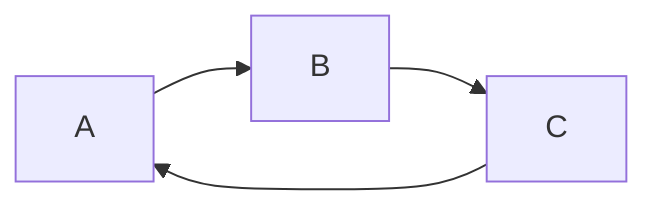

**markdown扩展语法介绍**

并非所有Markdown应用程序都支持扩展语法元素。

本文档基于<https://www.markdownguide.org/>上面的内容，同时参考了vs code插件[Markdown Preview Enhanced](https://github.com/shd101wyy/vscode-markdown-preview-enhanced)的功能。

# 表格 { #table }

| Syntax      | Description |
| ----------- | ----------- |
| Header      | Title       |
| Paragraph   | Text        |

## 对齐|格式化

| Syntax      | Description | Test Text     |
| :---        |    :----:   |          ---: |
| Header\|    | **Title**   | a&#124;b      |
| Paragraph   | [baidu][1]  | `vim`         |

[1]: https:www.baidu.com

# 【围栏代码块】

如果不想使用缩进来产生代码块，可以使用如下风格

```
{
  "firstName": "John",
  "lastName": "Smith",
  "age": 25
}
```

## 语法高亮

```json
{
  "firstName": "John",
  "lastName": "Smith",
  "age": 25
}
```

## 显示行数

```javascript {.line-numbers}
function add(x, y) {
  return x + y
}
```
## 高亮代码行数
```ruby {highlight=2}
require 'redcarpet'
markdown = Redcarpet.new("Hello World!")
puts markdown.to_html
```


# 【脚注】

脚注使您可以添加注释和参考，而不会使文档正文混乱。

Here's a simple footnote,[^1] and here's a longer one.[^bignote]

[^1]: This is the first footnote.

[^bignote]: Here's one with multiple paragraphs and code:

    Indent paragraphs to include them in the footnote.
    
    `{ my code }`
    
    Add as many paragraphs as you like.


# 【标题id】
[跳转到标题：表格](#table)

# 【删除线】
~~The world is flat.~~ We now know that the world is round.

# 【任务清单】
- [x] Write the press release
- [ ] Update the website
- [ ] Contact the media

# 【Emoji & Font-Awesome】

## Emoji
有两种方法可以将表情符号添加到Markdown文件中：将表情符号复制并粘贴到Markdown格式的文本中，或者键入emoji shortcodes。

在大多数情况下，您可以简单地从[Emojipedia](https://emojipedia.org/)等来源复制表情符号并将其粘贴到文档中。 

一些Markdown应用程序允许您通过键入表情符号短代码来插入表情符号：
例如：
:joy:
:rocket:
:muscle:

参考: `emoji.md`文件，或者[Complete list of github markdown emoji markup](https://gist.github.com/rxaviers/7360908)

Emoji & Font-Awesome只适用于 markdown-it parser 而不适用于 pandoc parser。
缺省下是启用的。你可以在插件设置里禁用此功能。

## Font-Awesome

示例如下：

:fa-telegram:
:fa-car:
:fa-skype:

# 【上下标】

注意，vscode自带的markdown预览功能不支持这里的一些特性。

上： 30^th^
下：H~2~O

# 【标记】
==marked==

# 【数学】

这里设置渲染引擎为：

    "markdown-preview-enhanced.mathRenderingOption": "MathJax"


默认的KaTeX 拥有比 MathJax 更快的性能，但是它却少了很多 MathJax 拥有的特性。

通过命令面板Markdown Preview Enhanced: Open Mathjax Config打开 MathJax 设置文件。

**行内显示**

1. $ x=\frac{-b\pm \sqrt{b^{2} -4ac}}{2a} $

2. $ f(a) = {1\over 2\pi i} \oint \frac{f(z)}{z-a}dz $

3. \( \iiint _{V} f( x,y,z) dV = \iiint\limits _{V} f( x,y,z) dxdydz \)

**块显示**
$$ \vec{\nabla} \times \vec{F} =
            \left( \frac{\partial F_z}{\partial y} - \frac{\partial F_y}{\partial z} \right) \mathbf{i}
          + \left( \frac{\partial F_x}{\partial z} - \frac{\partial F_z}{\partial x} \right) \mathbf{j}
          + \left( \frac{\partial F_y}{\partial x} - \frac{\partial F_x}{\partial y} \right) \mathbf{k} 
$$
$$
(\nabla_X Y)^k = X^i (\nabla_i Y)^k =
           X^i \left( \frac{\partial Y^k}{\partial x^i} + \Gamma_{im}^k Y^m \right)
$$
$$
 \int_D (\mathbf{\nabla} \cdot \mathbf{F})dV=\int_{\partial D} \mathbf{F}\cdot \mathbf{n}dS 
$$
$$
\sigma = \sqrt{ \frac{1}{N} \sum_{i=1}^N (x_i -\mu)^2} 
$$

```math
  \def\arraystretch{1.5}
   \begin{array}{c:c:c}
   a & b & c \\ \hline
   d & e & f \\
   \hdashline
   g & h & i
\end{array}
```

$$\begin{matrix}  a & b \\ c & d  \end{matrix}$$  

$$\begin{pmatrix}  a & b \\ c & d \end{pmatrix}$$

$$ \begin{bmatrix} a & b \\ c & d \end{bmatrix}$$

\[ \begin{vmatrix} a & b\\ c & d  \end{vmatrix} \]

# 【图像】

Markdown Preview Enhanced 内部支持 `flow charts`, `sequence diagrams`, `mermaid`, `PlantUML`, `WaveDrom`, `GraphViz`，`Vega & Vega-lite`，`Ditaa` 图像渲染。

例如：



# 【TOC】
Markdown Preview Enhanced 支持你在 markdown 文件中创建 TOC。 

你可以通过 `cmd-shift-p` 然后选择 Markdown Preview Enhanced: Create Toc 命令来创建 TOC。

# 【pandoc】

安装[pandoc](https://github.com/jgm/pandoc/releases)。
windows下载绿色压缩包，并添加路径设置，并控制是否使用Pandoc Parser。

```json
"markdown-preview-enhanced.pandocPath": "path\\to\\pandoc.exe",
"markdown-preview-enhanced.usePandocParser": false
```
