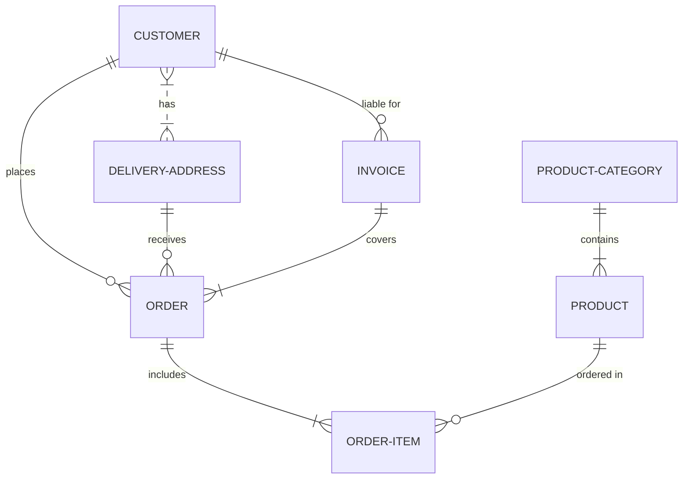

这里介绍了一些Github支持的高级格式。

# 【创建折叠部分】

<details><summary>点击此处展开</summary>
<p>

#### We can hide anything, even code!

```ruby
require 'redcarpet'
markdown = Redcarpet.new("Hello World!")
puts markdown.to_html
```

</p>
</details>

Markdown 是默认折叠的。


# 【创建图表】

可以使用以下三种不同的语法在 Markdown 中创建关系图：`mermaid`、`geoJSON` 和 `topoJSON`、`ASCII STL`。

## 创建 Mermaid 关系图

Mermaid 是一款受 Markdown 启发的工具，可将文本呈现为关系图。 例如，Mermaid 可以呈现流程图、序列图、饼图等。 有关详细信息，请参阅 [Mermaid 文档](https://mermaid.js.org/config/Tutorials.html)。

使用 `mermaid` 语言标识符在围栏代码块中添加 Mermaid 语法。

Here is a simple flow chart:




# 【编写数学表达式】

使用 Markdown 在 GitHub 上显示数学表达式。

GitHub 的数学呈现功能使用 `MathJax`；真是一种基于 `JavaScript` 的开源显示引擎。

**行内显示**

$x=\frac{-b\pm \sqrt{b^{2} -4ac}}{2a}$

$f(a) = {1\over 2\pi i} \oint \frac{f(z)}{z-a}dz$

$\iiint _{V} f( x,y,z) dV = \iiint\limits _{V} f( x,y,z) dxdydz$

**块显示**

$$
(\nabla_X Y)^k = X^i (\nabla_i Y)^k =
           X^i \left( \frac{\partial Y^k}{\partial x^i} + \Gamma_{im}^k Y^m \right)
$$

$$
 \int_D (\mathbf{\nabla} \cdot \mathbf{F})dV=\int_{\partial D} \mathbf{F}\cdot \mathbf{n}dS 
$$

$$
\sigma = \sqrt{ \frac{1}{N} \sum_{i=1}^N (x_i -\mu)^2} 
$$


```math
\vec{\nabla} \times \vec{F} =
            \left( \frac{\partial F_z}{\partial y} - \frac{\partial F_y}{\partial z} \right) \mathbf{i}
          + \left( \frac{\partial F_x}{\partial z} - \frac{\partial F_z}{\partial x} \right) \mathbf{j}
          + \left( \frac{\partial F_y}{\partial x} - \frac{\partial F_x}{\partial y} \right) \mathbf{k} 
  
```

$$\begin{matrix}  a & b \\ c & d  \end{matrix}$$  

$$\begin{pmatrix}  a & b \\ c & d \end{pmatrix}$$

$$ \begin{bmatrix} a & b \\ c & d \end{bmatrix}$$

$$ \begin{vmatrix} a & b\\ c & d  \end{vmatrix} $$


# 【警示语】
Markdown不提供直接支持，可以结合区块引用和`Emoji`来实现。

> :warning: **Warning:** Do not push the big red button.

> :memo: **Note:** Sunrises are beautiful.

> :bulb: **Tip:** Remember to appreciate the little things in life.

# 【字体颜色】
Markdown 不允许您更改文本的颜色，但如果您的 Markdown 处理器支持 HTML，则可以使用 HTML 标签。该属性允许您使用颜色的名称或十六进制代码指定字体颜色。

<font color="ff00f6">This text is red!</font>

<p style="color:blue">Make this text blue.</p>

# 【视频快照】

如果您的 Markdown 应用程序支持 HTML，您应该能够通过复制和粘贴YouTube等视频网站提供的 HTML 代码，在 Markdown 文件中嵌入视频。

[](https://www.youtube.com/watch?v=Oo9uMA2FL6I)
